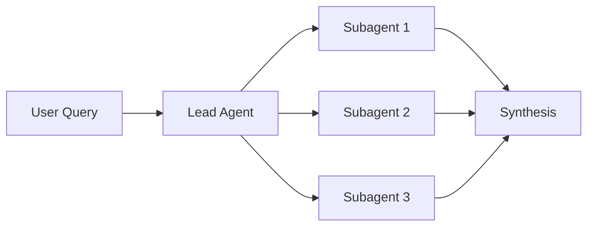

# Concise Deep ResearchAgentic Best Practices

## 🤖 Agent Design

**Orchestration Pattern**
- **Lead agent** plans & coordinates, **subagents** execute in parallel
- **3-5 subagents max** per task to avoid coordination chaos
- **Clear task boundaries** - each agent has distinct role & tools

**Resource Scaling**
- Simple queries: 1 agent, 3-10 tool calls
- Complex queries: 5+ agents, 10+ calls each
- **Token budget = performance predictor** - scale accordingly

## 🎯 Prompt Engineering

**Delegation Framework**
```
For each subagent provide:
✓ Specific objective
✓ Output format  
✓ Tool guidance
✓ Task boundaries
```

**Search Strategy**
- **Start broad → narrow down** (not hyper-specific initially)
- **Parallel tool calls** within each agent
- **Progressive refinement** based on findings

**Built-in Heuristics**
- Tool selection rules: specialized > generic
- Effort scaling rules: match complexity to resources  
- Quality checks: primary sources > SEO content

## 🧠 Agent Intelligence

**Thinking Modes**
- **Extended thinking** for planning (lead agent)
- **Interleaved thinking** for evaluation (subagents)
- Use as controllable reasoning scratchpad

**Self-Improvement**
- Let agents **debug their own prompts** when given failure examples
- Create **tool-testing agents** to improve descriptions
- **40% efficiency gains** from self-optimization

## 📊 Evaluation

**Tiered Approach**
1. **Small sample** (20 cases) → catch big improvements early
2. **LLM judge** → scale with rubric (accuracy, citations, completeness)
3. **Human testing** → catch edge cases & biases

**Focus on Outcomes**
- Judge **end results**, not process steps
- Accept **multiple valid paths** to goals
- **Checkpoint evaluation** for complex workflows

## 🚀 Production

**Error Resilience**
- **Resume capability** - don't restart from scratch
- **Model-aware error handling** - let agents adapt to failures
- **Regular checkpoints** to minimize recovery costs

**Deployment**
- **Rainbow deployments** - gradual version transitions
- **Full tracing** without content monitoring
- **Stateful coordination** across long conversations

## ⚡ Quick Implementation



**Core Components:**
- Orchestrator with clear delegation prompts
- Parallel subagent execution
- External memory for context persistence
- Error recovery mechanisms

**Success Metrics:**
- Performance vs single-agent baseline
- Token efficiency per task complexity
- Task completion rate
- Error recovery success

**Cost Reality:** 15× token usage vs chat - deploy only for high-value, parallelizable tasks.

