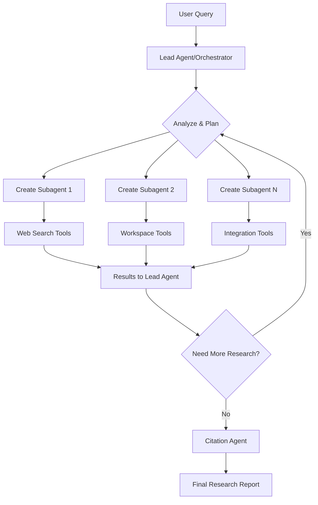

# Summary: Anthropic's Multi-Agent Research System

## Key Benefits & Performance

- **90.2% performance improvement** over single-agent Claude Opus 4 on internal research evaluations
- **Token usage scaling**: Multi-agent systems use ~15× more tokens than chat, but agents use ~4× more than chat
- **Parallelization advantage**: Excels at breadth-first queries requiring multiple independent investigation paths
- **Token usage correlation**: 80% of performance variance in BrowseComp evaluation explained by token usage alone

## Architecture: Orchestrator-Worker Pattern

## 8 Key Prompt Engineering Principles

| Principle | Description |
|:----------|:------------|
| **Think like agents** | Use Console simulations to understand agent behavior step-by-step |
| **Teach delegation** | Lead agent needs clear task descriptions, output formats, tool guidance |
| **Scale effort appropriately** | Simple queries: 1 agent, 3-10 calls; Complex: 10+ agents with clear division |
| **Tool design critical** | Explicit heuristics for tool selection, clear descriptions prevent wrong paths |
| **Let agents self-improve** | Claude 4 can diagnose failures and suggest prompt improvements (40% efficiency gain) |
| **Start wide, narrow down** | Begin with broad queries, then progressively focus |
| **Guide thinking process** | Extended thinking mode for planning, interleaved thinking for evaluation |
| **Parallel tool calling** | 3-5 subagents in parallel + 3+ tools per subagent = 90% speed improvement |

## Evaluation Strategy

### Three-Tier Approach:
1. **Small sample testing** (20 queries) - catches dramatic early improvements
2. **LLM-as-judge** - scales evaluation with rubric covering factual accuracy, citations, completeness, source quality
3. **Human evaluation** - catches edge cases like SEO content farm bias over authoritative sources

## Production Challenges & Solutions

### Key Engineering Issues:
- **State management**: Agents maintain long-running state across many tool calls
- **Error handling**: Minor failures can cascade into major behavioral changes  
- **Debugging complexity**: Non-deterministic behavior makes troubleshooting difficult
- **Deployment coordination**: Rainbow deployments prevent disruption of running agents
- **Synchronous bottlenecks**: Current system waits for all subagents before proceeding

### Reliability Patterns:
- Durable execution with resume capabilities
- Model-aware error handling (let agents adapt to tool failures)
- Full production tracing for debugging
- Regular checkpoints to prevent restart costs

## Key Takeaways

⚠️ **Trade-offs**: 15× token cost increase requires high-value tasks to justify expense

✅ **Sweet spot**: Tasks with heavy parallelization, information exceeding single context windows, complex tool interfaces

🚀 **User impact**: Days of research time saved, business opportunities discovered, complex technical problems resolved

The system demonstrates that **multi-agent architectures effectively scale token usage** for complex tasks, with careful engineering bridging the significant gap between prototype and production reliability.

